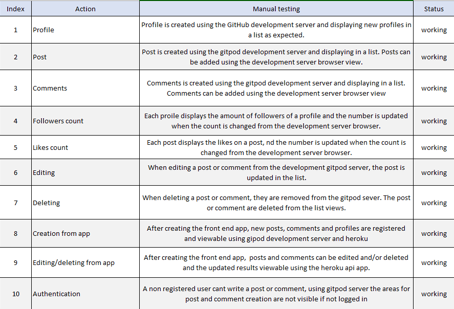

# **Wanderlust API**
Waderlust API is the backbone of your online travel diary app, where you can post anecdotes about your travel adventures! Both for yourself to remember, to share with family and friends as well as to inspire other fellow wanderlusters around the globe. The travel diary aims to be a platform for inspiration, discussions and sharing about all things travel related.

**Wanderlust** 

Live front end site [Wanderlust](https://wanderlust-p5.herokuapp.com/)  
Live back end site [Wanderlust API](https://wanderlust-api-p5.herokuapp.com/)
 
 

## **Content**
1. [**Project goal**](#project-goal)
2. [**Entity Relationship Diagram**](#entity-relationship-diagram)
3. [**Technologies**](#technologies) 
4. [**Testing**](#testing)
    - [Manual testing](#manual-testing)
    - [Code validation](#code-validation)
    - [Bugs & fixes](#bugs-and-fixes)
5. [**Deployment**](#deployment)
    - [Deployment](#deployment)
    - [Clone](#clone)
    - [Forking](#forking)
6. [**Credits**](#credits)
    - [Content](#content)
    - [Acknowledgement](#acknowledgement)

[Back to top](#wanderlust)

 

---

## **Project goal**

The goal with this full stack project is to create a content sharing online travel diary that allows the user to create, read, update and delete their content for a fully interactive experience. 

The goals are summarised here:

- Make the apps **React** front end content connect smoothly with the **Django REST** back end to store, fetch and delete content.
- Allow the users to comment, like and follow other users.
- Make a responsive app that are easily accessible on every viewport, and with screen readers.
- Make a easily navigated app, with intuitive features 

What the user will be looking for:

- Images and posts about someones travel in diary form
- Inspiration for their next travel
- Information about someones trip
- Information about a location they like to travel to
- Information about the others users of the site
- Interaction with other people interested in traveling

[Back to top](#wanderlust)

 

## **Entity Relationship Diagram**

 

The planing of the database models, aka the Entity Relationship Diagram, is illustrated below:

 

 

And the finished models:
 

 

[Back to top](#wanderlust)

## **Technologies**
---

To structure the building process of the project I used a project board on GitHub: [Kanban](https://github.com/Monika-81/wanderlust-api/projects/1).

 

### **Language**

**Django REST Framework**
  For this project the Python based framework Django REST is the development language for the back end API. I used sqlite3 database in development and PostgreSQL database on heroku, psycopg2 as the adapter and a gunicorn server implementation using WSGI standard. I installed a battery of extra libraries to help run everything smoothly:

    * Pillow (Python Imaging Library)
    * Cloudinary (to host static files)
    * And multiple Django rest libraries (authentication, filters, jwt-tokens, django database url)

 

### **Tools**

- [Heroku](https://www.heroku.com/)
    -  I used Heroku to deploy the application. 

- [Cloudinary](https://cloudinary.com/)
    - To store the images for the project.

- [Lucid Chart](https://www.lucidchart.com/pages/)
    - I used Lucid Chart to design the data model mock up for the project.

- [GitPod](https://www.gitpod.io/)
    - I used GitPod as the code editor as well as to display to test out changes in my code.

- [GitHub](https://github.com/)
    - I used GitHub to create a repository for my project.

[Back to top](#wanderlust)

---

## **Testing**

### **Manual testing**

During the entire developing stage I repeatedly tested the elements added and altered using the development server GitPod provides. After the site was live deployed I also checked the site regularly from heroku to see that all was up to par and that new content from the front end was registered in the database.

 
Deloyed API to Heroku, lists of database content:

 
 

### **Code validation**
 

- [Python PEP8 Validator](http://pep8online.com/) 

When the basic structure of the project was done I ran code validation through the PEP8 Validator. This procedure was repeated multiple times to validate that new the code was working during the developing process. Mostly the PEP8 reported bugs with whitespace, both too much whitespace as missing whitespace in the code, as well as with my lines being too long. The settings.py still have seven errors in the end due to too long lines and codenames or continuing line over indented. None of those have I changed since that ended up rendering other errors.
Below are the final test of the python files in PEP8:

- settings.py (with errors)
- profiles/views.py (example of result from all the other files)

 

 

 

### **Bugs and fixes**

There were a number of small bugs and mishaps committed through the development manily because of whitespace, type-o's and extra linebreaks. But mainly everything ran smoothly with the help of the Code Institute cheat sheet's for the Django REST project. 

**The major bugs where**:  

1. I forgot to install the right version of Django (version 4), wanting to follow the LMS without breaking the code.

    - Had to restart the project and create a new workspace, installing Django3.2.

     

2. After creating the posts app, uploading an image wouldn't work but instead broke the application with the message:   "The 'image' attribute has no file associated with it".

    - Unclear what the error was, I tried to delete the post app and restart it. But made the problem worse. So I restarted the entire project once again. Transferred code from old workspace to the new, until installment of posts app.

     

3. Had repeted problems with deployment to heroku: Code problem in settings.py not connecting rest_framework and later after deployment rendering a 400 Bad request message.

    - I was missing the psycopg2 installment.Had to restructure the settings.py file. Adding code for ALLOWED_HOSTS to heroku and changed code for CORS_ALLOWED_ORIGIN_REGEXES.

     

4. After building the front end app, the signin/signup didn't work. The profile was created to the back end api but I could not progress onto the wite. Got the message that the request was not allowed by CORS: "No-Access-Origin-Allowed". After trying to go through the code for many hours, trying to find fixes from StackOverflow and Slack etc I got help from tutor support:
    
    - It ended up being a missing "HTTPS://" in the heroku config var CLIENT_ORIGIN.

 
 

[Back to top](#wanderlust)

---

## **Deployment**

### **Deployment**

The project was deployed to **Heroku** from **GitPod** using two heroku apps for each GitPod repository:
- After creating an account or logging in to an existing one on Heroku, click the "New" button on the right hand side of the 'Personal' menu.
- Choose the option 'Create new app' and then choose a unique name for your application and the right region. Then click 'Create New App'.
- Next you need to add buildpacks and create config vars, this is utterly **important** to have done before you deploy your app!
 
    - Go to the resourse tap and search for postgres under add-ons, add the Postgres Hobby Dev to the app.
    - Now go back to the top of the page and click "Settings", then add config vars by clicking 'Reveal Config Vars'.
    - For this project in production state you need:
        - ALLOWED_HOST
        - CLIENT_ORIGIN
        - CLOUDINARY_URL
    - If you need additional config vars, for example 'secret key', 'database urls' etc they need to be set here as well.

- Now it's time to deploy the app. Once again go back to the top of the page and click "Deploy".
- Choose a deployment method, I used GitHub since my repository is located on GitHub.
- Scroll down to 'Connect to GitHub' and search for your project. Make sure you are connected to the right GitHub account. Click 'Connect'.
- Keep scrolling downwards, now you can choose between Automatic Deployment or Manual Deployment. I choose Manual first, until the app was properly deployed and a link to the app was visual. Then I choose to enable automatic deployment for smoother testing. 

The live back-end app can be found here: https://wanderlust-api-p5.herokuapp.com/
 
 

A copy of this GitHub Repository can be made by either making a copy on your local machine or by forking the GitHub content. By using a copy of the repository changes can be made to the copy without affecting the original code. To make a copy of the repository, follow these steps:

### **Clone**
- Locate the repository at **GitHub**.
- At the top of the file's menu, click the green *code* button to the right.
- The first option in the drop-down menu is clone, where you get three choices of how to clone the repository.
- To clone a copy of the python project, click the 'copy' icon on the right-hand side of **Clone with HTTPS**.
- Choose your code editor, open GitBash and change the working directory to where you want the cloned directory to be made saved.
- In the terminal you write git clone and then paste the copied URL. Like this: '$ git clone https://github.com/Monika-81/wanderlust-api.git' 
- Press enter and then install the dependencies you like to use for the project.

### **Forking**
- Locate the repository at **GitHub**.
- At the top right-hand side is a button called *fork*, click on the button to create a copy of the original repository in your GitHub Account.
 

The front end repository is found at: https://github.com/Monika-81/wanderlust-p5

[Back to top](#wanderlust)

---

## **Credits**

### **Content**

For most of the development and bug fixes I went back to the Code Institute LMS (over and over again!) and the learning material for the Django REST Framework section of the course. While setting up the API the provided Cheat Sheets in that section was heavily relied on. Most of the API code is based on the moments project to focus on learning and understanding the functions better, but adjusted to fit this project. 

### **Media**

- The image used for the default profile image on Cloudinary, is the same as was used in the LMS for the walkthrough project API. It worked for the same purpose for my site and I saw no need to search for a similar picture to use in my project.

### **Acknowledgement**

- My mentor **Sammy Dartnall** at Code Institute for valuable input, support and encouragement.
- The Code Institute Tutor support when I got stuck with bugs uploading the content to Heroku.
- The Slack community for being such an open, warm and sharing place. 
- **Viet Hoang** for letting me run the app by him and for getting user experience input before, during and at the final stage of the project.

[Back to top](#wanderlust)

---